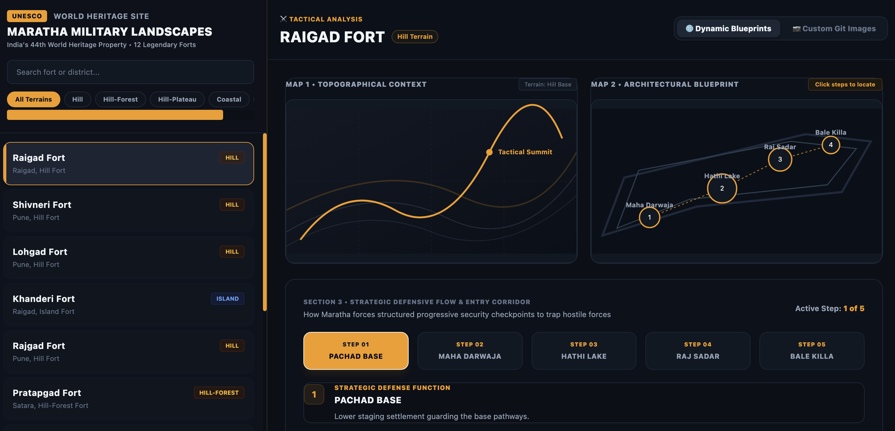

🏰 Maratha Military Landscapes: UNESCO Interactive Dashboard

Welcome to the Maratha Military Landscapes Dashboard—an interactive, single-page React application designed to showcase the awe-inspiring engineering, strategic defense systems, and geographical brilliance of the 12 Maratha forts nominated for the UNESCO World Heritage list.
This dashboard offers an immersive split-screen experience (1/3 interactive list, 2/3 dynamic workspace) highlighting the brilliant military architecture developed under the visionary leadership of Chhatrapati Shivaji Maharaj and subsequent Maratha rulers.

🌟 Features

12 UNESCO Nominated Forts: Detailed profiles including regional location, fort type (Hill, Sea, or Peninsula), elevation, and precise coordinates.

Dual Visualization Modes:

Interactive Blueprints (Default): Dynamic, mathematical vector-based maps (SVGs) drawn with code. No image downloads required—works right out of the box!
Custom Git Images: A toggle switch that lets you display your own uploaded, real-world custom photographs, geological maps, and flow diagrams.
Step-by-Step Tactical Flow: An interactive flow diagram for each fort, showing the sequential route an invading force would have to take (and how the defense elements funnel, delay, and neutralize them).
Modern responsive Design: High-contrast, dark-mode military aesthetic with elegant saffron-gold accents, powered by Tailwind CSS.

Instant Load: Runs 100% in the web browser using lightweight CDN links—no complex setup, terminal installations, or compilation required.

🗺️ The 12 Forts Featured

The dashboard includes comprehensive tactical breakdowns of the following sites:

Raigad Fort (The Sovereign Capital - Hill Fort)
Shivneri Fort (The Birthplace - Hill Fort)
Lohgad Fort (The Iron Fortress - Hill Fort)
Khanderi Fort (The Island Guardian - Sea Fort)
Rajgad Fort (The First Capital - Hill Fort)
Pratapgad Fort (The Jungle Fort of Javli - Hill Fort)
Suvarnadurg (The Golden Anchor - Sea Fort)
Panhala Fort (The Tableland Fortress - Hill Fort)
Vijaydurg Fort (The Gibraltar of the East - Sea Fort)
Sindhudurg Fort (The Lead-Bound Island - Sea Fort)
Salher Fort (The Skyward Peak - Hill Fort)
Gingee Fort (The Troy of the East - Hill Complex)

📁 Repository Structure

Your repository should be organized like this to make sure all images load correctly:

├── index.html           # Main React dashboard code
├── README.md            # This documentation file
└── images/              # Folder containing your custom images
    ├── raigad_geo.jpg
    ├── raigad_layout.jpg
    ├── raigad_flow.jpg
    ├── shivneri_geo.jpg
    └── ... (images for all 12 forts)

🛠️ Image Naming Convention

If you enable the "Custom Git Images" mode on the live site, the React application will search the images/ folder for files named using this strict lowercase structure:

Geographical Map: [fort-id]_geo.jpg
Architectural Layout: [fort-id]_layout.jpg
Flow Diagram: [fort-id]_flow.jpg
(Example for Pratapgad: pratapgad_geo.jpg, pratapgad_layout.jpg, and pratapgad_flow.jpg)

🚀 Technical Architecture

This project is built using modern frontend technologies to ensure smooth performance:

React (v18) - Handles active state, interactive tabs, dynamic maps, and search queries instantly without refreshing.
Tailwind CSS - Provides a responsive, mobile-friendly grid layout with sophisticated micro-animations and smooth scroll mechanics.
Babel Standalone - Compiles the React JSX syntax directly in the user's browser, eliminating the need for a Node.js development server.

🤝 Contributing & Acknowledgments

This project was built to document, preserve, and celebrate the incredible military history of India. All geographical data and structural notes are compiled from archaeological surveys, academic papers, and official drafts of the UNESCO World Heritage nomination dossier.
If you have higher resolution maps, historic blueprints, or updated flow diagrams for any of these forts, feel free to compress them and submit a pull request!

---

## Author

Rohit Patil
